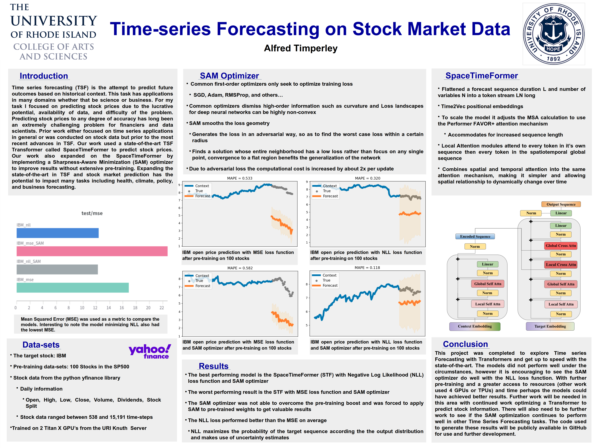

# Multivariate Time-series Forecasting on Stock Market Data

The original repository of the SpaceTimerFormer created by Jake Grigsby and Yanjun Qi can be found here https://github.com/QData/spacetimeformer

The following is my research into [Multivariate Time-series Forecasting on Stock Market Data](CSC_561_Final_Report.pdf)

